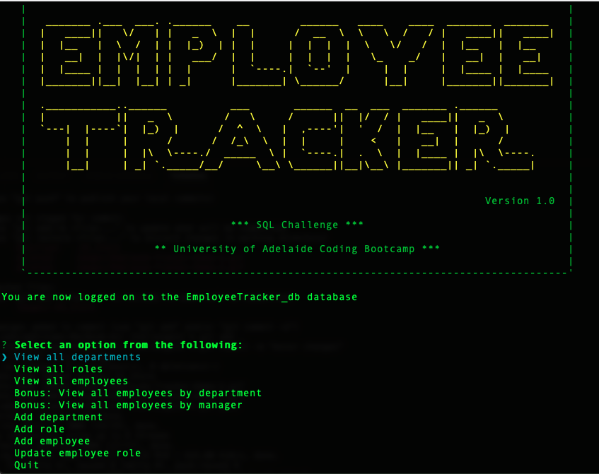

# Employee Tracker 

## Description

The `Employee Tracker` is a command-line content management system or CMS that helps manage employee data, via a database.
The application is created using `node.js`. It utilises the npm package `Inquirer` and `MySQL` database.

## Table of Contents

- [Installation](#installation)
- [Usage instructions](#usage-instructions)
- [Preview of the application](#preview-of-the-application)
- [Demo and walkthough](#demo-and-walkthough)
- [Test results](#test-results)

# Installation

1. Clone the repo from GitHub to your local folder.
2. Run the command `npm i` to install the following dependencies

```md
`asciiart-logo`
`console.table`
`dotenv`
`inquirer`
`mysql2`
```

3. Run the `MySQL` script `schema.sql`. This is needed to create the database and necessary tables and data constraints.
4. If required, run script `seeds.sql` for adding test data to test the application.

## Usage instructions

To start using the Employee Tracker:

1. Run the command `node index.js` from the command prompt.
2. Select an option, using the cursor keys on the keyboard.
3. Follow the commands to carry out a task.
   > Example: To add a new department: Select "Add department" > Enter Dept ID > Enter Dept Name.
4. The following options are available.

```md
View all departments
View all roles
View all employees
View employees by department
View employees by manager
Add department
Add role
Add employee
Update employee role
Quit
```

## Preview of the application



## Demo and walkthough
**Note**: The walk through includes execution of the `MySQL` scripts `schema.sql` and `seeds.sql`.


## Test results

The following are different screenshots of the database, post ADD and UPDATE operations.

### ADD Department

Added: `401 IT Dept`

```
+-----+------------------+
| id  | dept_name        |
+-----+------------------+
| 200 | Finance          |
| 300 | Human Resources  |
| 400 | Engineering      |
| 401 | IT Dept          |
| 500 | Sales            |
| 600 | Customer Service |
| 700 | Leadership       |
+-----+------------------+
```

### ADD Role

Added: `407 System Admin $89900 401(IT Dept)`

```
+-----+-------------------+--------+---------------+
| id  | title             | salary | department_id |
+-----+-------------------+--------+---------------+
| 201 | Accountant        |  85000 |           200 |
| 301 | HR Officer        |  80000 |           300 |
| 302 | HR Manager        | 100000 |           300 |
| 401 | Software Engineer |  85000 |           400 |
| 402 | Technical Writer  |  85000 |           400 |
| 403 | Eng Manager       | 100000 |           400 |
| 407 | System Admin      |  89900 |           401 |
| 501 | Sales Executive   |  80000 |           500 |
| 502 | Sales Manager     | 100000 |           500 |
| 601 | CS Officer        |  80000 |           600 |
| 602 | CS Manager        | 100000 |           600 |
| 701 | Director          | 150000 |           700 |
+-----+-------------------+--------+---------------+
```

### ADD Employee

Added: `10018, John CITIZEN, 407 (System Admin), 10002 (Bezalel SIMMEL)`

```
+-------+------------+-----------+---------+------------+
| id    | first_name | last_name | role_id | manager_id |
+-------+------------+-----------+---------+------------+
| 10001 | George     | FACELLO   |     701 |       NULL |
| 10002 | Bezalel    | SIMMEL    |     403 |      10001 |
| 10003 | Parto      | BAMFORD   |     401 |      10002 |
| 10004 | Chirstian  | KOBLIK    |     402 |      10002 |
| 10005 | Kyoichi    | MALINIAK  |     302 |      10001 |
| 10006 | Anneke     | PREUSIG   |     301 |      10005 |
| 10007 | Tzvetan    | ZIELINSKI |     502 |      10001 |
| 10008 | Saniya     | MIRZAN    |     501 |      10007 |
| 10009 | Sumant     | THOMAS    |     501 |      10007 |
| 10010 | Dirk       | VANDORK   |     601 |      10001 |
| 10011 | Mary       | SLUIS     |     401 |      10010 |
| 10012 | Patricia   | BRIDGLAND |     601 |      10010 |
| 10013 | Eberhardt  | TERKKI    |     601 |      10010 |
| 10014 | Berni      | GENIE     |     501 |      10007 |
| 10015 | Sarah      | PEREIRA   |     401 |      10002 |
| 10018 | John       | Citizen   |     407 |      10002 |
+-------+------------+-----------+---------+------------+
```

### UPDATE Employee Role

### Before

```
+-------+------------+-----------+---------+------------+
| id    | first_name | last_name | role_id | manager_id |
+-------+------------+-----------+---------+------------+
| 10011 | Mary       | SLUIS     |     601 |      10010 |
+-------+------------+-----------+---------+------------+
```

#### After

```
+-------+------------+-----------+---------+------------+
| id    | first_name | last_name | role_id | manager_id |
+-------+------------+-----------+---------+------------+
| 10011 | Mary       | SLUIS     |     401 |      10010 |
+-------+------------+-----------+---------+------------+
```
