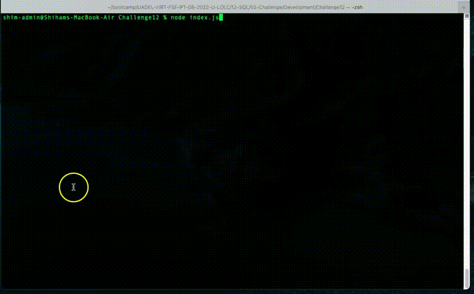

# Employee Tracker 

## Description

The `Employee Tracker` is a command-line content management system or CMS that helps manage employee data, via a database.
The application is created using `node.js`. It utilises the npm package `Inquirer` and `MySQL` database.

## Table of Contents

- [Installation](#installation)
- [Usage instructions](#usage-instructions)
- [Preview of the application](#preview-of-the-application)
- [Demo and walkthough](#demo-and-walkthough)
- [Test results](#test-results)

# Installation

1. Clone the repo from GitHub to your local folder.
2. Run the command `npm i` to install the following dependencies

```md
`asciiart-logo`
`console.table`
`dotenv`
`inquirer`
`mysql2`
```

3. Run the `MySQL` script `schema.sql`. This is needed to create the database and necessary tables and data constraints.
4. If required, run script `seeds.sql` for adding test data, to test the application.

## Usage instructions

To start using the Employee Tracker:

1. Run the command `node index.js` from the command prompt.
2. Select an option, using the cursor keys on the keyboard.
3. Follow the commands to carry out a task.
   > Example: To add a new department: Select "Add department" > Enter Dept ID > Enter Dept Name.
4. The following options are available:

```md
View all departments
View all roles
View all employees
View all employees by department
View all employees by manager
Add department
Add role
Add employee
Update employee role
Quit
```

## Preview of the application


## Demo and walkthough

### Employee Tracker Demo 1


### Employee Tracker Demo 2



## Test results

The following are different screenshots of the database, post ADD and UPDATE operations.

### ADD Department


### ADD Role


### ADD Employee


### UPDATE Employee Role

#### Before


#### After


